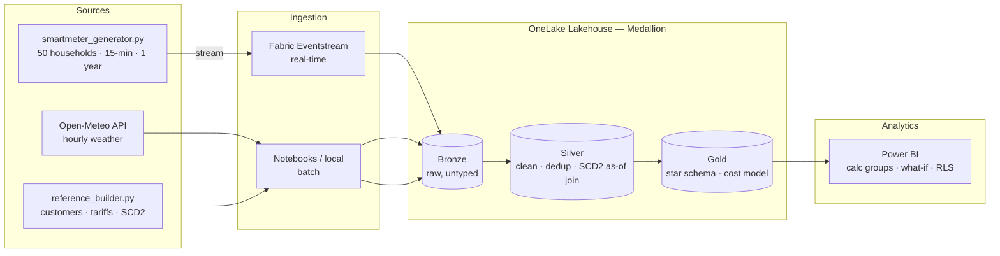

# ⚡ Electricity Billing — End-to-End Data Platform on Microsoft Fabric

A complete, production-shaped analytics platform for residential smart-meter data:
real-time streaming ingestion, a medallion (Bronze → Silver → Gold) lakehouse, and an
advanced Power BI report. Built on Microsoft Fabric with OneLake, Eventstream, Spark,
and Power BI Desktop.

> Synthetic but realistic: a simulated fleet of 50 households in Oslo, 15-minute meter
> readings across a full year (~1.76M readings), enriched with live weather and a
> slowly-changing tariff history — designed to exercise every stage of a modern data stack.

---

## 🏗️ Architecture



**Two ingestion paths, by design:** a live **streaming** path (meter readings through a
Fabric Eventstream into a Bronze Delta table) and a scheduled **batch** path (weather +
reference dimensions). Both land raw in Bronze; all cleaning happens downstream — the
medallion pattern done properly.

---

## 📸 Report highlights

> _Screenshots live in `powerbi/screenshots/`._

| Page | What it demonstrates |
|------|----------------------|
| **Consumption Explorer** | Field parameters — one chart the user re-points at any metric or dimension; a calculation group delivering MTD / YTD / rolling windows without measure sprawl |
| **Tariff Simulator** | A what-if parameter driving a live `SUMX` revenue model, with a headline sentence that rewrites itself as the slider moves |
| **Weather Lab** | Temperature→consumption elasticity computed **live in DAX** with `LINESTX`; the regression slope recalculates under any filter (solar vs non-solar households flip the slope) |
| **Quality Forensics** | Decomposition tree over quarantined faults + built-in anomaly detection, with drill-through to a per-meter detail page |
| **Meter Detail** | Drill-through target — a full single-meter profile reached by right-clicking any meter anywhere in the report |

---

## 🧱 The medallion layers

**Bronze** — raw landing zone. Streaming meter readings + weather (history & forecast) +
seven reference/dimension tables. No typing, no cleaning; schema kept permissive.

**Silver** — trustworthy data.
- Cast types, trim to the analysis window, deduplicate the stream/backfill overlap
- **Quarantine** bad-quality readings (SPIKE / STUCK / MISSING) into a separate table instead of silently dropping them
- **SCD2 as-of join**: each reading joined to the tariff that was active *on that date* (`reading_date BETWEEN valid_from AND valid_to`), because ~12% of meters switch tariff mid-year
- Merge weather history + forecast, archive winning on overlap

**Gold** — star schema for BI.
- `fact_meter_reading_gold` with a **time-of-use cost** calculation (rates are local-time
  windows; readings are UTC → converted before the rate join — a classic timezone trap handled correctly)
- `fact_daily_usage_gold` daily aggregate for fast dashboards
- `weather_daily_gold` for the elasticity analysis
- Conformed dimensions

---

## 🗂️ Repository structure

```
Azure-Fabric-electricity-billing/
├── README.md
├── .gitignore
│
│   # Data generation — single source of truth for config
├── smartmeter_generator.py     # fleet/location/window config + reading generator
├── weather_source.py           # Open-Meteo history + forecast, tidy hourly frames
├── reference_builder.py        # dim_customer, dim_meter, dim_tariff, SCD2 tariff history, dim_date
│
│   # Ingestion
├── send_to_fabric.py           # streams generated readings into a Fabric Eventstream
│
│   # Medallion transformations (local deltalake → OneLake)
├── load_bronze_local.py        # batch load: weather + reference dims into Bronze
├── load_silver_local.py        # Bronze → Silver (dedup, quarantine, SCD2 as-of join)
├── load_gold_local.py          # Silver → Gold (fact + cost model + aggregates)
│
│   # Utilities
├── smartmeter_inspect.py
├── smartmeter_viewer.py
├── smartmeter_viewer_table.py
│
│   # Power BI
├── energy_theme.json           # custom Power BI theme
└── screenshots/                # report page screenshots
```

---

## 🛠️ Tech stack

`Microsoft Fabric` · `OneLake` · `Delta Lake` · `Fabric Eventstream` · `PySpark` ·
`Python (pandas, deltalake, azure-eventhub, requests)` · `Power BI (DAX, calculation groups,
field parameters, what-if, RLS)` · `Open-Meteo API`

---

## ▶️ Running it yourself

```bash
pip install azure-eventhub requests pandas deltalake azure-identity

# 1. Generate a year of readings locally
python smartmeter_generator.py                  # -> sample_readings.jsonl

# 2. Stream live readings into your Fabric Eventstream
export FABRIC_ES_CONNECTION_STRING="Endpoint=sb://...;EntityPath=..."
python send_to_fabric.py                         # replay mode by default

# 3. Pull weather + build reference dimensions
python weather_source.py
python reference_builder.py

# 4. Load Bronze, then build Silver and Gold (local, against OneLake)
python load_bronze_local.py
python load_silver_local.py
python load_gold_local.py
```

> The transformations also exist as Fabric notebooks; the local `deltalake` scripts write
> straight to OneLake and were used as a capacity-independent fallback.

---

## 🎯 Skills demonstrated

- **Data engineering**: medallion architecture, streaming + batch ingestion, Delta Lake,
  idempotent overwrites, SCD2 handling, data quarantine, deduplication
- **Modeling**: proper star schema, single-direction relationships, marked date table,
  timezone-correct cost calculation
- **Advanced Power BI**: calculation groups with dynamic format strings, field parameters,
  what-if simulation, live regression in DAX (`LINESTX`), decomposition tree, anomaly
  detection, drill-through, row-level security
- **Engineering hygiene**: environment-variable secrets, reproducible config as a single
  source of truth, capacity-aware fallbacks

---

*Built as a hands-on learning project to demonstrate an end-to-end modern data platform.*

